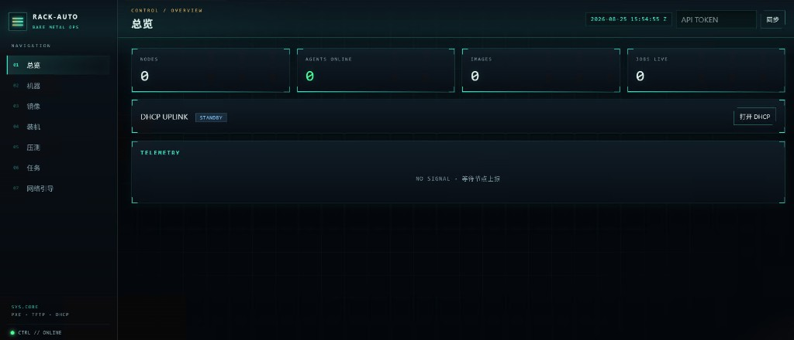

# 部署 Rack-auto

这份教程按「第一次把机器装起来」来写。你可以先扫一遍目录，再按自己的环境跳到对应章节。

做完之后，你应该能：在浏览器打开控制台 → 服务器 PXE 进内存系统（RAMOS）→ 下发镜像装机。

## 目录

1. [先看清整条链路](#1-先看清整条链路)
2. [你需要准备什么](#2-你需要准备什么)
3. [推荐网络怎么接](#3-推荐网络怎么接)
4. [安装控制面](#4-安装控制面)
5. [写配置（最容易写错的地方）](#5-写配置最容易写错的地方)
6. [bootstrap：本机 iPXE 与离线缓存](#6-bootstrap本机-ipxe-与离线缓存)
7. [启动服务](#7-启动服务)
8. [配置 DHCP](#8-配置-dhcp)
9. [第一次装机](#9-第一次装机)
10. [用 systemd 长期跑](#10-用-systemd-长期跑)
11. [升级控制面（下载二进制覆盖）](#11-升级控制面下载二进制覆盖)
12. [Docker 部署](#12-docker-部署)
13. [自检清单](#13-自检清单)
14. [常见问题](#14-常见问题)

---

## 1. 先看清整条链路

待装机服务器并不是直接去下操作系统 ISO，而是：

```
服务器开机（PXE）
    → DHCP 告诉它：TFTP 在哪、引导文件叫什么
    → TFTP 下载 undionly.kpxe（传统 BIOS）或 ipxe.efi（UEFI）
    → iPXE 再通过 HTTP 找控制面：/ipxe/boot.ipxe
    → 进入 RAMOS（内存里的 Ubuntu live-server + Agent）
    → 控制面下发「装哪个镜像、分区、用户、SSH 公钥、网卡」
    → Agent 写盘，写完切回本地磁盘重启
```

所以控制面要同时提供三样东西：**HTTP（Web + iPXE + API）**、**TFTP**、以及一台能应答 PXE 的 **DHCP**（内置或你现有的均可）。

---

## 2. 你需要准备什么

| 准备 | 说明 |
| --- | --- |
| 一台控制面主机 | **强烈建议 Linux**。要绑定 UDP 67/69，Windows 只能先用来看 Web，不适合当 PXE 服务器。 |
| 一块装机网卡 | 和控制面、待装机服务器在**同一二层网段**（同一交换机/VLAN）。 |
| 待装机服务器 | 支持 PXE；有 BMC（IPMI/Redfish）会更省事，没有也可以人肉进 BIOS 选网卡启动。 |
| 出网 | 第一次 `bootstrap` 要下载 Ubuntu 26.04 live-server ISO（约 **2.7GB**）。默认从 Ubuntu 官方 CD 镜像列表取路径并选延迟最低的（不含阿里云）；也可把 `ubuntu_mirror` 钉死。 |
| 内存 | 待装机服务器建议 **≥ 4GB**。PXE 客户端只把 `casper.iso`（squashfs 层，大约几百 MB～1.5GB）拉进内存，不再下 2.7GB 整包。2GB 的虚拟机仍可能 OOM。 |
| 磁盘 | 控制面预留约 **5GB** 给 RAMOS（完整 ISO 缓存 + `casper.iso`）；另外再为 cloud 镜像留空间。 |
| 管理员权限 | 绑定 DHCP/TFTP 特权端口需要 root（或等价能力）。 |

**不需要**事先给每台机器装操作系统。有 BMC 的话，连显示器都可以不用。

控制面磁盘建议预留：**RAMOS 约 5GB**（`live-server.iso` + `casper.iso`），再加上你要存的 cloud 镜像（每张大约 600MB～1GB）。

---

## 3. 推荐网络怎么接

实验室最小接法：一台交换机，控制面和待装机服务器都插在上面。

更稳妥的接法（机房常用）：

```
                    ┌─────────────┐
  办公/管理网 ─────►│  控制面 NIC0 │  SSH、浏览器看 Web
                    │             │
  PXE 装机网  ─────►│  控制面 NIC1 │  DHCP + TFTP + HTTP（public_url）
                    └──────┬──────┘
                           │
                    ┌──────┴──────┐
                    │  接入交换机  │  ← 待装机服务器 PXE 网卡都接这里
                    └─────────────┘

  BMC / IPMI 网 ──► 服务器 iLO/iDRAC（可以和管理网同一段，不要和 PXE 混用也行）
```

请记住三件事：

1. **`public_url` 必须是待装机服务器能访问的地址**，不要填 `127.0.0.1` 或 `localhost`。服务器 PXE 起来后，是它自己去拉内核和 Agent 的。
2. **同一二层不要跑两套 DHCP。** 机房里如果已经有 DHCP，用「沿用现有」；实验室空网段再用内置 DHCP。
3. 内置 DHCP **只绑在你指定的接入网卡上**，不要选到办公网上网的那块网卡。

---

## 4. 安装控制面

三条路，选一条即可。实验室从 **A** 最快；要长期跑选 **A 或 C**。

### A. 用 GitHub Release 二进制（推荐，不用装 Go）

到 [Releases](https://github.com/Songxwn/Rack-auto/releases/latest) 下载对应平台的包。**不要**在控制面主机上 `go build`，安装教程默认走这条路。

`v0.3.0` 压缩包里的文件名带平台后缀（`rackauto-linux-amd64`）；之后的版本会改成包内直接叫 `rackauto`。下面两套名字都写上了：

```bash
sudo mkdir -p /opt/rackauto/{bin,configs,data/agent/x86_64}
cd /tmp
curl -fLO https://github.com/Songxwn/Rack-auto/releases/latest/download/rackauto-linux-amd64.tar.gz
tar -tzf rackauto-linux-amd64.tar.gz
tar -xzf rackauto-linux-amd64.tar.gz

CTRL=$(ls -1 rackauto-linux-amd64 rackauto 2>/dev/null | head -n1)
AGENT=$(ls -1 rackauto-agent-linux-amd64 rackauto-agent 2>/dev/null | head -n1)
if [ -z "$CTRL" ] || [ -z "$AGENT" ]; then
  echo "解压后没有找到二进制，请看 tar -tzf 的输出"; ls -l; exit 1
fi
sudo install -m 0755 "$CTRL" /opt/rackauto/bin/rackauto
sudo install -m 0755 "$AGENT" /opt/rackauto/data/agent/x86_64/rackauto-agent
```

ARM 控制面把 `amd64` 换成 `arm64`，Agent 目录用 `data/agent/aarch64/`。Windows 压缩包是 `.zip`，只适合看 Web，PXE 请换 Linux。

若还要给 ARM 服务器装机，再下一份 `rackauto-linux-arm64.tar.gz`，把其中的 Agent 放到 `data/agent/aarch64/rackauto-agent`。

以后升级不要重装目录，按 [第 11 节](#11-升级控制面下载二进制覆盖) 下载新包、覆盖这两个文件即可。

### B. 从源码编译（可选）

只在你要改代码时才需要。必须是 **Go 1.25 工具链**。本机若是 Go 1.26 且报 `nfcSparseValues`，说明安装不完整，用下面的 `GOTOOLCHAIN` 即可，不必先修好 GOROOT。

还要先 `mkdir -p bin`，否则 `go build -o bin/rackauto` 会直接失败。

```bash
git clone https://github.com/Songxwn/Rack-auto.git
cd Rack-auto
export GOTOOLCHAIN=go1.25.3
export GOPROXY=https://goproxy.cn,direct
mkdir -p bin
go build -o bin/rackauto ./cmd/rackauto
go build -o bin/rackauto-agent ./cmd/rackauto-agent
```

也可以 `make build` 或 `bash scripts/build.sh`（Windows：`powershell -File scripts/build.ps1`）。

`bootstrap` 若找不到 `go`、但 `data/agent/` 里已经有 Release 的 Agent，会跳过交叉编译。

### C. Docker

见 [第 12 节](#12-docker-部署)。镜像里已经带好 Linux Agent，仍需要执行一次 `bootstrap` 下载 Ubuntu live-server ISO。

---

## 5. 写配置（最容易写错的地方）

```bash
# 源码目录里：
cp configs/rackauto.example.yaml configs/rackauto.yaml

# 或 Release 安装到 /opt/rackauto 时：
sudo cp configs/rackauto.example.yaml /opt/rackauto/configs/rackauto.yaml
# （若没有 clone，可从仓库复制 example：https://github.com/Songxwn/Rack-auto/blob/main/configs/rackauto.example.yaml）
```

用编辑器打开，**至少改这两项**：

```yaml
listen: ":8080"
public_url: "http://10.0.0.50:8080"   # 改成控制面在「装机网」上的地址
data_dir: "./data"                    # /opt 安装建议改成 /opt/rackauto/data
api_token: "请换成一段随机字符串"       # 建议打开；Web 右上角 Token 填同一个
tftp_listen: ":69"
```

怎么查「装机网」地址：

```bash
ip -4 addr
# 或
ip -br a
```

例如接入网卡是 `enp1s0`，地址是 `10.0.0.50/24`，则 `public_url` 写成 `http://10.0.0.50:8080`。

`dhcp` 段可以先保持 `enabled: false`，启动后再到 Web「网络引导」里选网卡、点应用。YAML 里的 DHCP 只是默认值；Web 保存后会写进数据库，优先于 YAML。

---

## 6. bootstrap：本机 iPXE 与离线缓存

iPXE 固件已经打进控制面程序，**PXE 阶段不会访问 boot.ipxe.org**。`serve` 启动时也会自动把 `undionly.kpxe` / `ipxe.efi` 写到 `data/tftp/`。

RAMOS 使用 **Ubuntu 26.04 LTS live-server**（当前最新稳定版 LTS）。第一次需要联网把 ISO 缓存到本机，抽出 `casper/vmlinuz`、`casper/initrd`，再打一份只含 squashfs 层的 `casper.iso`；之后整个装机网可以离线。PXE 客户端只拉 `casper.iso`，不会把 2.7GB 整包灌进内存。

`ubuntu_mirror` 留空（或写成 `auto`）时，bootstrap 会从 [Ubuntu 官方 CD 镜像列表](https://launchpad.net/ubuntu/+cdmirrors) 拉取路径（**不使用阿里云**），再并行探测并选 **HTTP 延迟最低** 且能拿到 `SHA256SUMS` 的那一家。ISO 文件名和校验和以 `releases.ubuntu.com` / `cdimage.ubuntu.com` 为准。想钉死某源时再填完整 URL：

```yaml
bootstrap:
  ubuntu_release: "26.04"
  ubuntu_mirror: "https://mirrors.tuna.tsinghua.edu.cn/ubuntu-releases"
```

若已经有 ISO，不必再下：

```yaml
bootstrap:
  ubuntu_iso: "/path/to/ubuntu-26.04-live-server-amd64.iso"
```

```bash
# 源码目录（有网，只需一次）
./bin/rackauto bootstrap -config configs/rackauto.yaml

# /opt 安装
sudo /opt/rackauto/bin/rackauto bootstrap \
  -config /opt/rackauto/configs/rackauto.yaml \
  -data-dir /opt/rackauto/data

# 之后完全离线再执行（只校验缓存、重装内置 iPXE）
./bin/rackauto bootstrap -offline -config configs/rackauto.yaml
```

它会做：

1. 把内置 iPXE 写到 `data/tftp/`（BIOS：`undionly.kpxe`，UEFI：`ipxe.efi`）
2. 下载 Ubuntu live-server ISO 到 `data/ramos/ubuntu/<arch>/live-server.iso`（约 2.7GB，可续传；这是控制面缓存，机器不拉这个文件）
3. 抽出 `vmlinuz` / `initrd.stock`，打出 `casper.iso`，并把启动脚本接到 `initrd` 后面
4. 若当前目录有源码，交叉编译 Linux Agent 到 `data/agent/`

已经存在且完整的 ISO / 内核会跳过，可以重复执行。下载中断会留着 `.tmp`，下次自动续传。

没有 Go、又没从源码 bootstrap 时，请从对应架构的 Release 包拷入 Agent（文件名带平台后缀）：

```bash
sudo mkdir -p /opt/rackauto/data/agent/x86_64 /opt/rackauto/data/agent/aarch64
sudo install -m 0755 rackauto-agent-linux-amd64 /opt/rackauto/data/agent/x86_64/rackauto-agent
sudo install -m 0755 rackauto-agent-linux-arm64 /opt/rackauto/data/agent/aarch64/rackauto-agent
```

---

## 7. 启动服务

UDP 67（DHCP）和 69（TFTP）是特权端口，**第一次请用 root**：

```bash
sudo ./bin/rackauto serve -config configs/rackauto.yaml
# 或
sudo /opt/rackauto/bin/rackauto serve \
  -config /opt/rackauto/configs/rackauto.yaml \
  -data-dir /opt/rackauto/data
```

看到类似日志就对了：

```
TFTP :69 目录 .../data/tftp
控制台 http://127.0.0.1:8080  版本 v0.2.0
```

若 TFTP 失败，多半是没 root，或本机已有 tftpd 占着 69。

本机浏览器打开 `http://控制面IP:8080`。若配置了 `api_token`，在右上角 **API TOKEN** 里填同一串，失焦即会记住。左下角变成 `CTRL // ONLINE` 就对了：



侧栏「总览 / 机器 / 镜像 / 装机 / 压测 / 任务 / 网络引导」对应后面几步；DHCP 还没开时，总览里会显示 `STANDBY`，点「打开 DHCP」会跳到网络引导页。

防火墙放行（按你实际用的工具选一套）：

```bash
# firewalld
sudo firewall-cmd --add-port=8080/tcp --permanent
sudo firewall-cmd --add-port=69/udp --permanent
sudo firewall-cmd --add-port=67/udp --permanent   # 仅在使用内置 DHCP 时
sudo firewall-cmd --reload

# ufw
sudo ufw allow 8080/tcp
sudo ufw allow 69/udp
sudo ufw allow 67/udp
```

云主机安全组同样要放行这些端口，并且 **DHCP/TFTP 通常只能在同二层内网用**，不要指望跨公网 PXE。

---

## 8. 配置 DHCP

打开控制台 **07 网络引导**。上方「控制面地址」应与 `public_url` 一致，不对就改完点保存。

### 方案一：实验室，用内置 DHCP

适合：交换机上**没有**别的 DHCP，你愿意让 Rack-auto 发地址。

1. 勾选「启用内置 DHCP」
2. **接入网卡**选连着装机交换机的那块（不要选上网网卡）
3. 选中后会按网卡 IPv4 自动填网段、next-server、地址池（一般是 `.100–.200`），可再改
4. 点 **保存并应用**
5. 状态应变为「运行中」，总览页 DHCP 显示 `LIVE`

地址池不要覆盖控制面自己的 IP，也不要覆盖网关。

### 方案二：机房已有 DHCP，只改引导项

不要启用内置 DHCP。把现有服务器的 `next-server` 指到控制面，并按固件选文件名。

ISC dhcpd 示例：

```
next-server 10.0.0.50;
if exists user-class and option user-class = "iPXE" {
  filename "boot.ipxe";
} elsif option client-arch != 00:00 {
  filename "ipxe.efi";
} else {
  filename "undionly.kpxe";
}
```

dnsmasq 示例：

```
dhcp-userclass=set:ipxe,iPXE
dhcp-boot=tag:ipxe,boot.ipxe
dhcp-match=set:efi64,option:client-arch,7
dhcp-boot=tag:!ipxe,tag:efi64,ipxe.efi,,10.0.0.50
dhcp-boot=tag:!ipxe,undionly.kpxe,,10.0.0.50
```

iPXE 自己 chainload 时：

```
dhcp
chain http://10.0.0.50:8080/ipxe/boot.ipxe
```

Web 同一页底部会按你当前的 `public_url` 生成一份可复制片段。

---

## 9. 第一次装机

建议第一次用一台**可以重装**的机器，磁盘会被覆盖。

### 9.1 登记机器（两种方式）

**有 BMC：** 打开「机器」→「登记机器 / BMC」。填名称、MAC（PXE 那块网卡）、固件（UEFI 或 BIOS）、BMC 协议与地址。保存后可用「开机 / PXE重启」试一下。

**没有 BMC：** 到机柜把服务器设为「网卡 PXE 启动」，直接开机。进 RAMOS 后，Agent 会向控制面报到，机器列表里会出现它。

### 9.2 准备镜像

「镜像」页先选**系统和版本**（Debian 12/13、Ubuntu 24.04、Rocky 9 等），再：

- **登记 URL**（推荐）：例如 Ubuntu 24.04 cloud  
  `https://cloud-images.ubuntu.com/noble/current/noble-server-cloudimg-amd64.img`  
  类型选「云镜像（整盘 qcow2/raw）」
- **上传文件**：大文件建议用 URL 登记。本机上传时页面会显示进度、速率和剩余时间；传到控制面后会检测分区表和引导。

系统和版本决定装机时怎么写网卡（Ubuntu/Debian 13 用 netplan，Debian 11/12 用 ifupdown，Rocky/Alma 8 用 ifcfg，Rocky/Alma 9+ 用 NetworkManager），以及默认根文件系统（RHEL 系多为 xfs）。装完会把根分区扩到磁盘剩余空间。

待装机服务器也要能访问这个 URL；若只有内网，把镜像传到控制面「上传」，URL 会变成 `http://<public_url>/images/...`。

### 9.3 下发任务

打开「装机」，按三步向导用下拉框和表单填写，不再贴 JSON：

1. 选择机器和镜像，选固件与时区
2. 登录用户默认 `root`（也可改成 ubuntu/debian 等发行版用户），填密码；公钥可「添加」或「导入 .pub 文件」
3. 从机器上报的库存里选择目标磁盘和网卡。根文件系统镜像可在分区表里增删分区（勾选「使用剩余空间」）；整盘云镜像会保留镜像自带分区，并在写盘后把根分区扩到整盘。网卡可选 DHCP / 静态，也可添加 Bond 和 VLAN（VLAN 可以建在 Bond 上）。

有 BMC 可在最后一步点「同时 BMC PXE 重启」。到「任务」看进度和日志。成功后机器会切回本地磁盘重启。

### 9.4 没有 PXE 时的调试

在已经能进系统的 Linux 上（不要在生产盘上乱试）可以手工跑 Agent：

```bash
./rackauto-agent --url http://10.0.0.50:8080 --token <api_token>
```

---

## 10. 用 systemd 长期跑

仓库提供了 [deploy/rackauto.service](../deploy/rackauto.service) 示例。

```bash
sudo cp deploy/rackauto.service /etc/systemd/system/rackauto.service
# 按实际路径编辑 ExecStart、WorkingDirectory
sudo systemctl daemon-reload
sudo systemctl enable --now rackauto
sudo journalctl -u rackauto -f
```

---

## 11. 升级控制面（下载二进制覆盖）

升级 = **下载 GitHub Release → 覆盖两个二进制 → 重启进程**。不要在控制面 `go build`，也不要重装整个 `/opt/rackauto`。

配置、数据库、已上传镜像、RAMOS 的 ISO / `casper.iso` **都不要动**。SQLite 打开后会自己加列。

### 要覆盖哪两个文件

| 文件 | 作用 |
| --- | --- |
| `rackauto` | 控制面本身（Web、API、PXE、DHCP） |
| `rackauto-agent` | 机器 PXE 进 RAMOS 之后从控制面下载的 Agent |

**两个都要换。** 只换控制面时，网页版本号会变，装机仍走旧 Agent（例如仍会覆盖镜像自带的 fstab）。已停在 RAMOS 里的机器要**重新 PXE**，才会下载到新 Agent。

默认安装路径：

```text
/opt/rackauto/bin/rackauto
/opt/rackauto/data/agent/x86_64/rackauto-agent
```

ARM 控制面或 ARM 待装机服务器：Agent 在 `data/agent/aarch64/rackauto-agent`。若两种架构都要装，两份 Agent 都覆盖。

按 [README 最短路径](../README.md) 装在仓库目录时，对应的是 `bin/rackauto` 和 `data/agent/<arch>/rackauto-agent`。

### systemd（推荐）

在**控制面 Linux**上执行。把包名里的 `amd64` 换成你的架构（ARM 控制面用 `arm64`）。

```bash
# 1. 看现在跑的是哪一版（网页左下角也会显示）
curl -sS http://127.0.0.1:8080/api/v1/health
# 期望类似：{"ok":true,"name":"rackauto","version":"v0.4.10"}

# 2. 下载最新包（钉死版本则把 latest 换成 download/v0.4.10）
cd /tmp
curl -fLO https://github.com/Songxwn/Rack-auto/releases/latest/download/rackauto-linux-amd64.tar.gz
tar -tzf rackauto-linux-amd64.tar.gz
tar -xzf rackauto-linux-amd64.tar.gz

CTRL=
AGENT=
[ -f rackauto ] && CTRL=rackauto
[ -z "$CTRL" ] && [ -f rackauto-linux-amd64 ] && CTRL=rackauto-linux-amd64
[ -f rackauto-agent ] && AGENT=rackauto-agent
[ -z "$AGENT" ] && [ -f rackauto-agent-linux-amd64 ] && AGENT=rackauto-agent-linux-amd64
if [ -z "$CTRL" ] || [ -z "$AGENT" ]; then
  echo "解压后没有找到二进制，请看 tar -tzf 的输出"; ls -l; exit 1
fi

# 3. 停服务，覆盖，再启动（不要动 configs/ 和 data/）
sudo systemctl stop rackauto
sudo install -m 0755 "$CTRL" /opt/rackauto/bin/rackauto
sudo install -m 0755 "$AGENT" /opt/rackauto/data/agent/x86_64/rackauto-agent
# 若还要给 ARM 机器装机，再解压 arm64 包：
# sudo install -m 0755 rackauto-agent /opt/rackauto/data/agent/aarch64/rackauto-agent
sudo systemctl start rackauto
sudo systemctl status rackauto --no-pager

# 4. 确认版本号已经变了
curl -sS http://127.0.0.1:8080/api/v1/health
```

`install` 是覆盖目标路径上的文件，不会新建一套目录。正在跑的进程用的是内存里的旧映像，所以**覆盖后必须重启**。

没有 systemd、前台跑的：先停掉 `rackauto serve`（Ctrl+C 或 `kill`），按同样方式 `install` 覆盖，再：

```bash
sudo /opt/rackauto/bin/rackauto serve \
  -config /opt/rackauto/configs/rackauto.yaml \
  -data-dir /opt/rackauto/data
```

### 升级之后还要不要 bootstrap

一般**不用**。`data/ramos/`、`data/tftp/`、已上传镜像都还在。

发行说明里若写了「必须再跑 bootstrap」（例如换成 `casper.iso` 那种引导方式），再执行一次即可：已有完整 ISO 不会重下。

### 机器侧

1. 浏览器强刷控制台，左下角版本应等于新 tag。
2. 下一次装机前让节点重新 PXE（网页里 PXE 引导，或 BMC 下次启动改网卡）。已经停在旧 RAMOS 里的 Agent 不会自动热更新。
3. 打开「镜像」页：v0.4.10 起会检测已上传镜像的分区表和引导。

### Docker

Compose 不是「覆盖宿主机两个文件」，而是更新镜像后重建容器。数据在 volume 里，配置仍是挂进去的 `configs/rackauto.yaml`：

```bash
cd /path/to/Rack-auto
git fetch --tags
git checkout v0.4.10   # 或 git pull 跟 main
cd deploy
docker compose up -d --build
curl -sS http://127.0.0.1:8080/api/v1/health
```

不要在 Windows 宿主机上 `go build`。构建发生在 Docker 里。

---

## 12. Docker 部署

Compose 使用 `network_mode: host`，这样 DHCP/TFTP 才能绑网卡。请先在仓库根目录准备好配置：

```bash
cp configs/rackauto.example.yaml configs/rackauto.yaml
# 编辑 public_url、data_dir 可保持默认，容器内会用 -data-dir /var/lib/rackauto
cd deploy
docker compose up -d --build
docker compose exec rackauto rackauto bootstrap -config /etc/rackauto.yaml -data-dir /var/lib/rackauto
```

之后浏览器访问宿主机 `:8080`。内置 DHCP 仍要在 Web 里选**宿主机**网卡名（host 网络下看到的就是宿主机网卡）。

---

## 13. 自检清单

按顺序打勾，卡在哪一步就去下一节对号入座。

- [ ] `curl -sS http://<public_url>/api/v1/health` 返回正常（从**另一台机器**测，不要只在控制面本机测 `127.0.0.1`）
- [ ] `ls data/tftp/` 里有 `undionly.kpxe` 和 `ipxe.efi`
- [ ] `ls data/ramos/ubuntu/x86_64/` 里有 `vmlinuz`、`initrd`、`casper.iso`、`layerfs-path`（`live-server.iso` 是控制面缓存，大约 2.7GB）
- [ ] `ls data/agent/x86_64/rackauto-agent` 文件存在且可执行
- [ ] 控制台左下角是 `CTRL // ONLINE`
- [ ] DHCP：要么内置显示运行中，要么现有 dhcpd/dnsmasq 已改 next-server
- [ ] 服务器 PXE 后能看到 iPXE，而不是一直 `DHCP...`
- [ ] 机器列表出现该节点，或你已手工登记 MAC
- [ ] 装机任务日志里能看到写盘、注入用户，而不是下载内核 404

---

## 14. 常见问题

**如何升级到新版本**  
不要重装、不要编译。按 [第 11 节](#11-升级控制面下载二进制覆盖) 下载 Release，覆盖 `rackauto` 和 `rackauto-agent`，重启控制面。只换其中一个，装机行为不会完整更新。

**镜像要选系统和版本**  
Debian 12 和 Ubuntu 24.04 写网卡的方式不同（ifupdown / netplan），Rocky 8 和 9 也不一样（ifcfg / NetworkManager）。登记或上传时选对系统和版本，装机才会写入对应配置。Bond 和 VLAN（含 Bond 上的 VLAN）在装机向导第 3 步添加。

**`go build` 失败 / undefined: nfcSparseValues / 找不到 bin/rackauto**  
生产环境请用 Release，不要编译。若一定要编：

1. 先 `mkdir -p bin`，再 `go build -o bin/rackauto ./cmd/rackauto`（目录不存在会直接失败）。
2. 指定工具链，避开损坏的本机 Go 1.26：`export GOTOOLCHAIN=go1.25.3`
3. 国内拉模块：`export GOPROXY=https://goproxy.cn,direct`
4. 或直接 `make build` / `bash scripts/build.sh`

**解压 Release 后没有叫 rackauto 的文件**  
`v0.3.0` 包内是 `rackauto-linux-amd64` 和 `rackauto-agent-linux-amd64`。用 `tar -tzf` 看实际名字，再 `install` 到 `/opt/rackauto/bin/rackauto`。

**iPXE 报 Network unreachable（https://ipxe.org/28086011），随后反复出现 iPXE 画面**  
这是两件事叠在一起：

1. **网关不在 PXE 网段。** 例如地址是 `192.168.177.100/24`，网关却是示例里的 `10.0.0.1`。打开「网络引导」，重新选一次接入网卡（会把网关改成这块网卡的 IP），再点保存并应用。
2. **iPXE 循环。** 已经进入 iPXE 后应下发本机 TFTP 的 `boot.ipxe`，不能再给 `undionly.kpxe`。请更新控制面后重启，并把 `public_url` 改成 PXE 网段地址（例如 `http://192.168.177.1:8080`）。内核和脚本都从控制面拉取，不访问公网。

**PXE 一直 DHCP timeout**  
二层不通、选错接入网卡、或网段里另有 DHCP 在抢。抓包看 UDP 67/68。确认交换机没有 DHCP snooping 拦了控制面。

**能拿到地址，TFTP 失败 / PXE-E32**  
69/udp 没放行，或 `data/tftp` 里没有对应文件。再跑一次 `bootstrap`。部分网卡 UEFI 更吃 `snponly.efi`，可在现有 DHCP 里改 filename 试一下。

**iPXE 出现，但拉 boot.ipxe / 内核失败**  
`public_url` 写成了 `127.0.0.1`，或填了管理网 IP 而 PXE 网卡到不了。用服务器所在网段的地址重设并保存。

**Web 能开，左下角 `CTRL // NO LINK` 或 `OFFLINE`**  
API Token 填错，或页面不是从控制面自己的 HTTP 打开的（不要用 `file://`）。

**DHCP 应用失败：请指定接入网卡 / 绑定 67 失败**  
启用时必须选网卡。67 被 dhcpd/dnsmasq 占用时先停掉旧服务，或改用「方案二」。Linux 请用 root。

**PXE 进了内核随后 Kernel panic / Attempted to kill init**  
紫屏上的 `KERNEL PANIC! Attempted to kill init! exitcode=0x00000100` 是 casper 的 init 退出，不是硬件坏了。常见原因：

1. **旧版把整张 2.7GB ISO 拉进内存。** 请换成 **v0.4.2+**，再跑一次 `bootstrap`（已有 `live-server.iso` 不会重下，会抽出 squashfs 打成 `casper.iso`），然后重启 PXE。
2. **没重新 bootstrap。** 新控制面会请求 `/ramos/ubuntu/<arch>/casper.iso`，没有这个文件就会找不到 live 介质。
3. **机器内存太小。** 建议 ≥ 4GB；2GB 虚拟机仍可能在 wget/`tmpfs` 时 OOM。
4. **`public_url` 对 PXE 网不可达**，或 `casper.iso` 404。串口/屏幕上应能看到 casper 在 HTTP 拉 `casper.iso`。

不要用带分号的 `ds=nocloud-net;s=...`：iPXE 会把 `;` 当成命令分隔符，内核命令行被截断。v0.4.4 用 `autoinstall cloud-config-url=.../user-data`（无分号）让 Subiquity 跑 early-commands 拉起 Agent，而不是语言选择界面。

**PXE 进了 Ubuntu「Welcome / 选择语言」安装界面**  
这是 Subiquity 交互安装，不是 RAMOS。v0.4.3 及更早关掉了 cloud-init 又没带 `autoinstall`，安装器就会停在语言选择，Agent 也不会注册。请换成 **v0.4.4+** 控制面后重新 PXE（不必重下 ISO）。成功时屏幕应停在 early-commands / Agent 日志，控制台出现该 MAC。若仍进语言界面：确认 `public_url` 对机器可达，并 `curl http://<public_url>/ipxe/cidata/<mac>/user-data` 能返回 `autoinstall:`。

**进了 Ubuntu / RAMOS 但控制台没有机器**  
画面停在 `running /bin/bash /tmp/ramos.sh` 是正常的（early-commands 不能返回，否则安装器会继续）。但 Agent 应马上出现在控制台。

- 若一直只有这一行、机器还不出现：多半是旧脚本在启动 Agent 前同步跑 `apt-get` 卡住了。请用 **v0.4.5+**，重启控制面后再 PXE。屏幕上应出现 `download .../rackauto-agent` 和 `starting rackauto-agent`。
- `cannot download rackauto-agent`：把 Release 里的 `rackauto-agent` 拷到控制面 `data/agent/x86_64/rackauto-agent`（ARM 用 `aarch64`）。
- `register: unauthorized`：网页右上角 Token 和控制面 `api_token` 不一致。
- 也可在安装器里切到 tty2（Alt+F2）看 `/var/log/rackauto.log`。

**装机写盘失败 / `qemu-img: executable file not found`**  
v0.4.5 为了先注册把 `apt-get` 放到后台，装机时可能还没装上 `qemu-utils`。请换成 **v0.4.6+** 的 `rackauto-agent`（拷到 `data/agent/x86_64/` 后重新 PXE）：Agent 会内置转换 qcow2，不依赖 `qemu-img`。权宜之计：在 RAMOS 里 `apt-get install -y qemu-utils` 后再从网页重发装机任务。

**装机写盘失败 / 镜像下不下来**  
镜像 URL 机器访问不了（HTTPS 证书、要代理）。改成控制面本地上传。确认类型选对（cloud 的 qcow2 选「云镜像」）。

**装完进不了系统**  
先看镜像页「引导」列：整盘云镜像需要有 UEFI ESP 和/或 BIOS boot 分区，且与向导里选的固件一致。v0.4.10 起上传/检测会解析 GPT 和 EFI 文件；装机时不再用向导分区表覆盖镜像自带的 fstab。若仍起不来：BMC 把下次启动改回磁盘，确认机器固件模式和镜像匹配。

**误把内置 DHCP 开到办公网**  
立刻在「网络引导」点「停止 DHCP」，并在交换机上确认没有别人拿错地址。生产环境优先沿用现有 DHCP。
